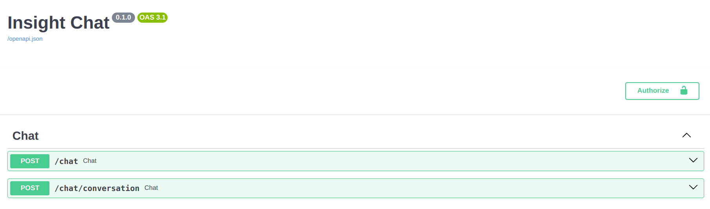
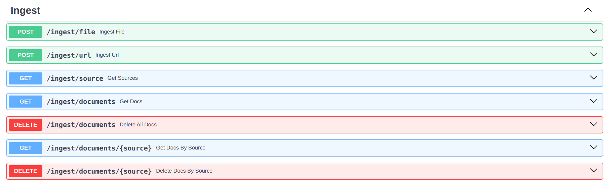
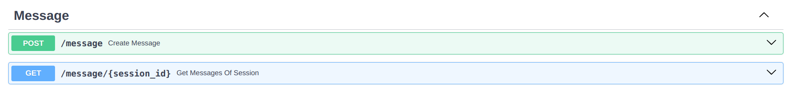
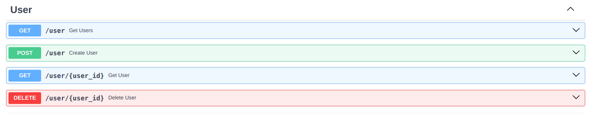
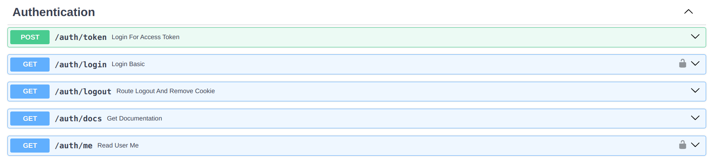
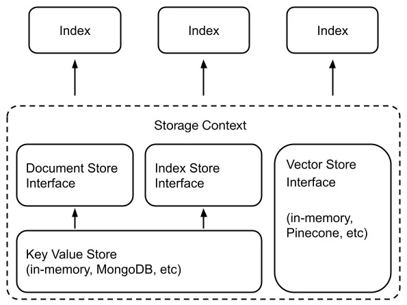

# Insight-Chat 🚀

# Build with 🛠️

- [FastAPI](https://fastapi.tiangolo.com/) - FastAPI is a modern, fast (high-performance), web framework for building APIs with Python 3.7+ based on standard Python type hints.

- [LlamaIndex](https://www.llamaindex.ai/) - LlamaIndex is a data framework for LLM-based applications which benefit from context augmentation. Such LLM systems have been termed as RAG systems, standing for “Retrieval-Augemented Generation”. LlamaIndex provides the essential abstractions to more easily ingest, structure, and access private or domain-specific data in order to inject these safely and reliably into LLMs for more accurate text generation.

- [MongoDB Atlas](https://www.mongodb.com/cloud/atlas) - MongoDB Atlas is a fully-managed cloud database developed by the same people that build MongoDB.

- [Atlas Vector Search](https://www.mongodb.com/products/platform/atlas-vector-search) - Atlas Vector Search lets you search unstructured data. You can create vector embeddings with machine learning models like OpenAI and Hugging Face, and store and index them in Atlas for retrieval augmented generation (RAG), semantic search, recommendation engines, dynamic personalization, and other use cases.

**Note:** You need creating a knn index to use Atlas Vector Search.

- Log in to your Atlas account and locate the collection corresponding to the Vector Store. If you are using the default names, it should be “default_store/default_db”.
- Create a Search index for the collection in tab `Atlas Search`. Choose the “Json Editor” mode and set index with following content:

```
{
  "mappings": {
    "dynamic": true,
    "fields": {
      "embedding": {
        "dimensions": 1536,
        "similarity": "cosine",
        "type": "knnVector"
      }
    }
  }
}
```

- Wait for a few seconds to let the new index take effect.

## Run app with uvicorn 🚀

### Requires

- Python >= 3.10

Install with poetry:

```
pip install poetry
poetry config virtualenvs.in-project true
poetry shell
poetry install
```

```
uvicorn app.main:app --host 127.0.0.1 --port 9080
```

## Run app with docker 🐳

```
docker build -t insight-chat .
docker run -d --name insight-chat -p 8080:8080 insight-chat
```

## Features:

### 1. Chat



- Chat with document
- Conversation chat with document

### 2. Ingest data



- You can ingest data from a file, link website, or youtube.

### 3. Message



- Manage message for conversation chat.

### 4. Chat Session


- Manage chat session for conversation chat.

### 5. User



- Manage user for application.

### 6. Authentication



- Authentication for application.

## Knowledges

### LlamaIndex’s Storage System

In short, LlamaIndex uses the following pattern to store document information:

The text of a document is divided into several Nodes, also known as “chunks”;
Using the document ID as the primary key, the objects representing each document, mainly metadata such as file name and hash, are stored in the Document Store, along with the list of Nodes for that document;
Using the Node ID as the primary key, the Node’s embedding is stored in the Vector Store.



The three MongoDB implementations for the Stores are used in this project:

- MongoDocumentStore
- MongoIndexStore
- MongoDBAtlasVectorSearch

## References

https://medium.com/@luoning.nici/llamaindex-in-depth-practice-how-to-build-a-reliable-storage-subsystem-with-mongodb-atlas-f306bf2fb480

https://docs.llamaindex.ai/en/stable/index.html

https://www.mongodb.com/atlas

### If this project helped you, please don't forget to give me a ⭐️. Thanks! 🌟
