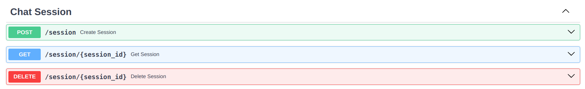

# Insight-Chat 🚀

# Build with 🛠️

- [FastAPI](https://fastapi.tiangolo.com/) - FastAPI is a modern, fast (high-performance), web framework for building APIs with Python 3.7+ based on standard Python type hints.

- [LlamaIndex](https://www.llamaindex.ai/) - LlamaIndex is a data framework for LLM-based applications which benefit from context augmentation. Such LLM systems have been termed as RAG systems, standing for “Retrieval-Augemented Generation”. LlamaIndex provides the essential abstractions to more easily ingest, structure, and access private or domain-specific data in order to inject these safely and reliably into LLMs for more accurate text generation.

- [MongoDB Atlas](https://www.mongodb.com/cloud/atlas) - MongoDB Atlas is a fully-managed cloud database developed by the same people that build MongoDB.

- [Atlas Vector Search](https://www.mongodb.com/products/platform/atlas-vector-search) - Atlas Vector Search lets you search unstructured data. You can create vector embeddings with machine learning models like OpenAI and Hugging Face, and store and index them in Atlas for retrieval augmented generation (RAG), semantic search, recommendation engines, dynamic personalization, and other use cases.

## Run app with uvicorn 🚀

### Requires

- Python >= 3.10

Install with poetry:

```
pip install poetry
poetry config virtualenvs.in-project true
poetry shell
poetry install
```

```
uvicorn app.main:app --host 127.0.0.1 --port 9080
```

## Run app with docker 🐳

```
docker build -t insight-chat .
docker run -d --name insight-chat -p 8080:8080 insight-chat
```

## Features:

### 1. Chat


- Chat with document
- Conversation chat with document

### 2. Ingest data


- You can ingest data from a file, link website, or youtube.

### 3. Message


- Manage message for conversation chat.

### 4. Chat Session



- Manage chat session for conversation chat.

### 5. User


- Manage user for application.

### 6. Authentication


- Authentication for application.


### If this project helped you, please don't forget to give me a ⭐️. Thanks! 🌟


